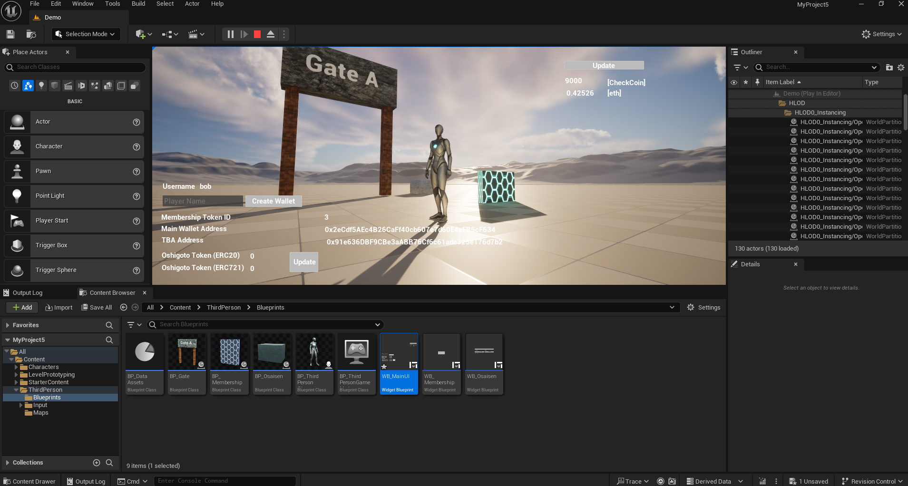
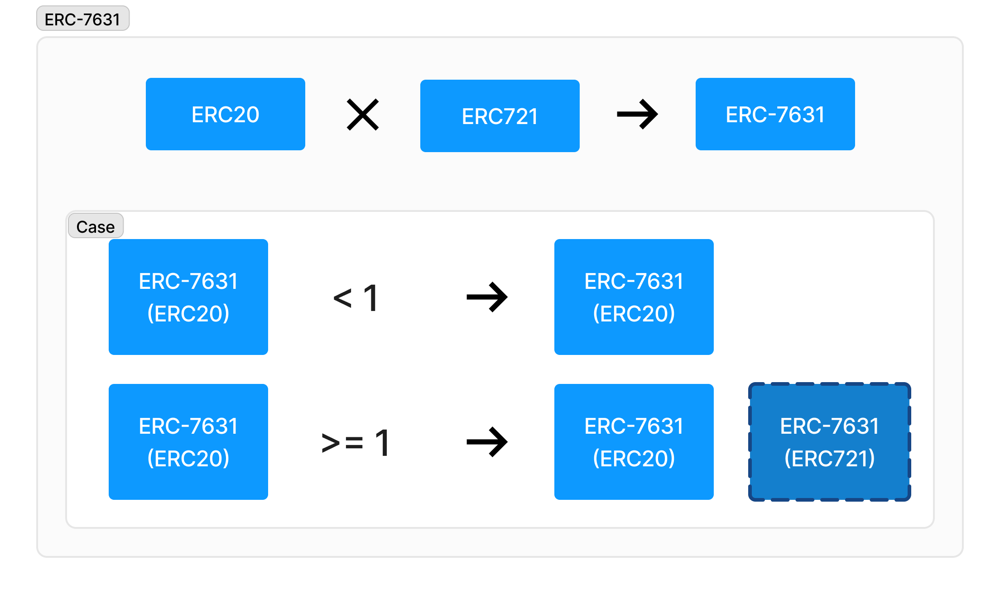
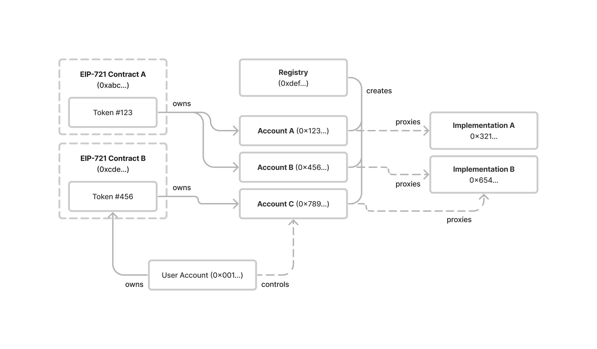
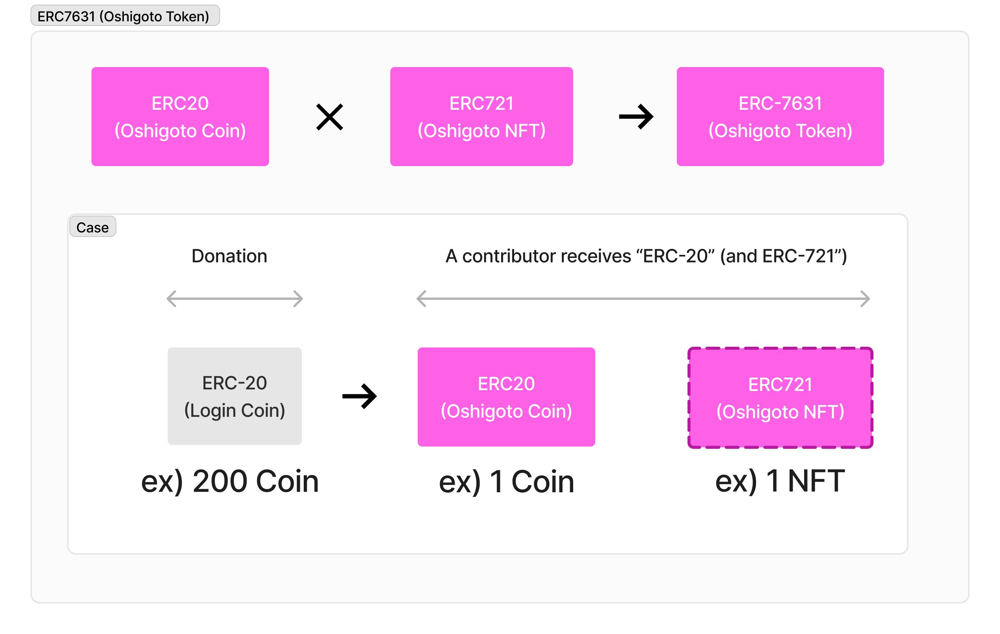
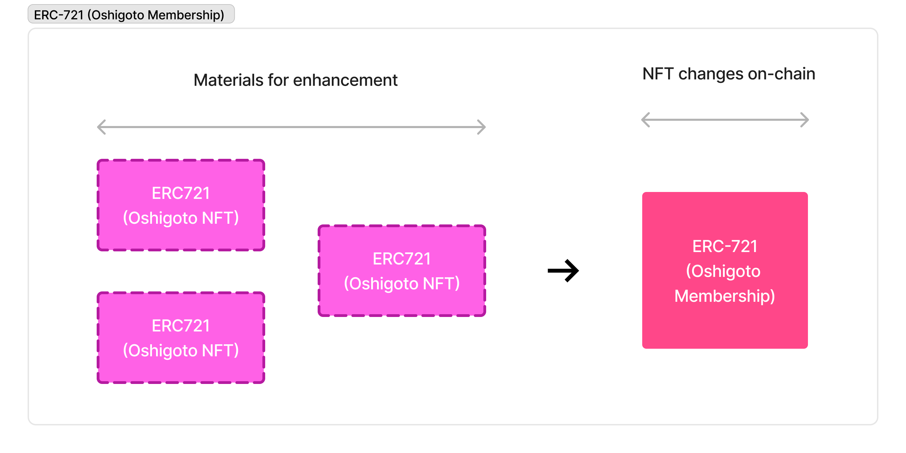

# Oshigoto Contracts
## Overview
Our project, "Oshigoto," aims to create an economic zone within the metaverse to support fan activities. This repository contains test contracts intended for an EVM environment.



## About ERC-7631



> A fungible ERC-20 token contract and non-fungible ERC-721 token contract can be interlinked, allowing actions performed on one contract to be reflected on the other. This proposal defines how the relationship between the two token contracts can be queried. It also enables accounts to configure whether ERC-721 mints and transfers should be skipped during ERC-20 to ERC-721 synchronization.
> - [ERC-7631, Abstract](https://eips.ethereum.org/EIPS/eip-7631)

## About ERC-6551

This system is designed to generate ERC-6551 accounts linked to membership cards issued under ERC-721. It is intended to be issued for each creator. The wallet is capable of receiving tokens issued through ERC-7631.

> The system outlined in this proposal has two main components:
> - A singleton registry for token bound accounts
> - A common interface for token bound account implementations
> The following diagram illustrates the relationship between NFTs, NFT holders, token bound accounts, and the Registry:




## About Oshigoto Token

This is a donation contract using ERC7631. It is a system where fans can donate to creators using ERC20 or native tokens and receive omikuji or points in return.



Automatically generated NFTs can be merged with NFTs intended for fan club members. Additionally, these NFTs are managed on-chain. Of course, membership and automatically generated NFTs can also be sold and purchased through the market.



## Contracts
| Contract                                           | Description            | Status |
| -------------------------------------------------- | ---------------------- | ------ |
| [LoginCoin](./src/LoginCoin.sol)                   | ERC20 Demo Token       | Draft  |
| [CheckCoin](./src/CheckCoin.sol)                   | ERC20 Demo Token       | Draft  |
| [OshigotoToken](./src/OshigotoToken.sol)           | DN404 Token            | Draft  |
| [OshigotoMembership](./src/OshigotoMembership.sol) | ERC721 Token           | Draft  |
| [ERC6551Registry](./src/ERC6551Registry.sol)       | ERC6551 Registry       | Draft  |
| [TokenBoundAccount](./src/TokenBoundAccount.sol)   | ERC6551 Implementation | Draft  |

## Tech Stack
- UE5
- HTTP Plugin
- Solidity
- Foundry
- ERC-7631（a.k.a DN404）
- ERC-6551
- Web3.py
- FastAPI
- Python
- Azure Container Apps

## API

- [Oshigoto API](https://github.com/yuk6ra/oshigoto-backend)

## Foundry

**Foundry is a blazing fast, portable and modular toolkit for Ethereum application development written in Rust.**

Foundry consists of:

-   **Forge**: Ethereum testing framework (like Truffle, Hardhat and DappTools).
-   **Cast**: Swiss army knife for interacting with EVM smart contracts, sending transactions and getting chain data.
-   **Anvil**: Local Ethereum node, akin to Ganache, Hardhat Network.
-   **Chisel**: Fast, utilitarian, and verbose solidity REPL.

## Documentation

https://book.getfoundry.sh/

## Usage

### Build

```shell
$ forge build
```

### Test

```shell
$ forge test
```

### Format

```shell
$ forge fmt
```

### Gas Snapshots

```shell
$ forge snapshot
```

### Anvil

```shell
$ anvil
```

### Deploy

```shell
$ forge script script/Counter.s.sol:CounterScript --rpc-url <your_rpc_url> --private-key <your_private_key>
```

### Cast

```shell
$ cast <subcommand>
```

### Help

```shell
$ forge --help
$ anvil --help
$ cast --help
```

## Development


```shell
make test
```

```shell
make deploy-mock-dn404
```

```shell
make deploy-checkcoin
make deploy-oshigototoken
```

## Deploy Oshigoto Membership

```.env
OSHIGOTO_TOKEN_ADDRESS=<your_oshigoto_token_address>
```

```shell
make deploy-membership
```

## Deploy MetaLivePOAP
```shell
make deploy-poap
```

## Verify Contract

example:
```shell
forge verify-contract --etherscan-api-key ${KEY} ${CONTRACT_ADDRESS} ./src/LoginCoin.sol:LoginCoin  --chain 11155111
```

## References
- Pandora Contract: [0x9E9FbDE7C7a83c43913BddC8779158F1368F0413](https://etherscan.io/address/0x9e9fbde7c7a83c43913bddc8779158f1368f0413#code)
- [DN404](https://github.com/Vectorized/dn404)
- [ERC-7631](https://eips.ethereum.org/EIPS/eip-7631)
- [ERC-6551](https://eips.ethereum.org/EIPS/eip-6551)